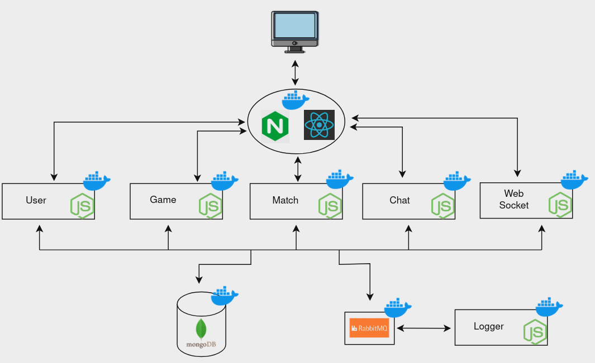

# Pro.io

The project consists of a web based game platform, where users can select one of the multiple games we will eventually propose, and battle with each other.

The idea came from the fact that we all love to play games, and we wanted to create an online experience where users could play together and interact while having fun.

---

## Table of Contents

- [Installation](#installation)
- [Usage](#usage)
- [Architecture](#architecture)
- [Documentation](#documentation)
- [Team](#team)

---

## Installation

1. Install [Docker](https://docs.docker.com/get-docker/)
2. Install [Docker Compose](https://docs.docker.com/compose/install/)
3. Clone the [Pro.io project repository](https://github.com/GMN177/Pro.io)
4. Go to the root directory of the project
5. Using the [*.env.example*](.env.example) file as a template, create a *.env* file with the necessary variables
6. In the root directory, run the following snippet to build and run the project:

```sh
docker compose up --build
```

---

## Usage

1. After completing the [Installation](#installation) steps, open your browser and go to [localhost](http://localhost)
2. Enjoy!

---

## Architecture



---

## Documentation

- [SCRUM and User Stories](docs/Pro.io_SCRUM_and_User_Stories.xlsx)
- [Booklet](docs/Pro.io_Booklet.pdf)
- [Presentation](docs/Pro.io_Presentation.pptx)

---

## Team

- Gian Marco Nobile 1836319
- Lorenzo Quinti 1869011
- Alfredo Lipari 2084986
- Antonio Marco D'Addetta 2088804
- Giovanni Buracci 2097143